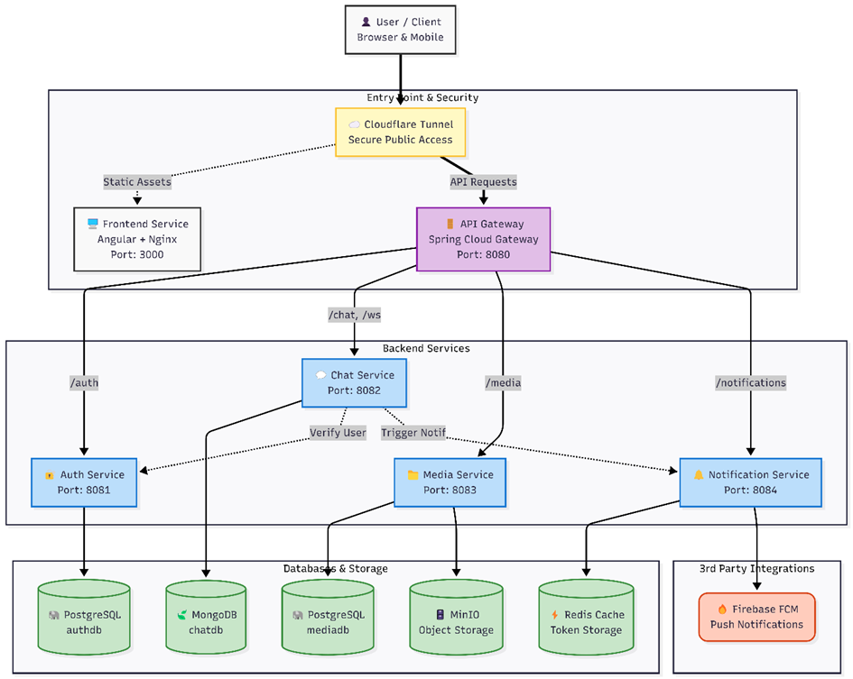
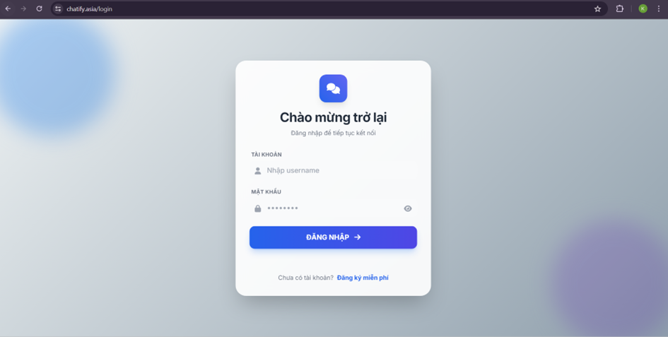
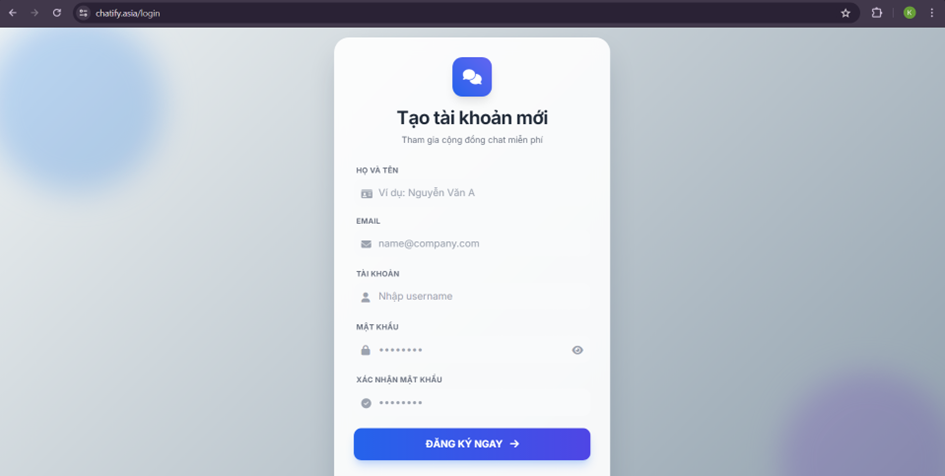
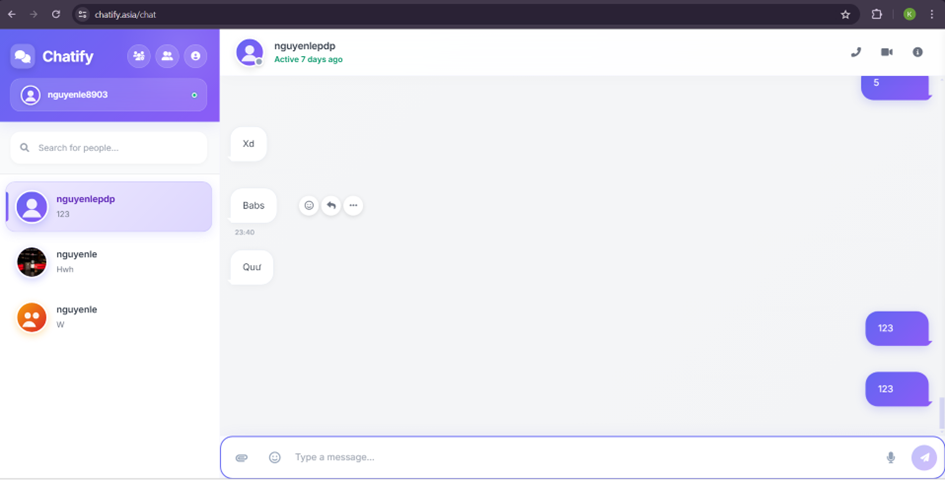
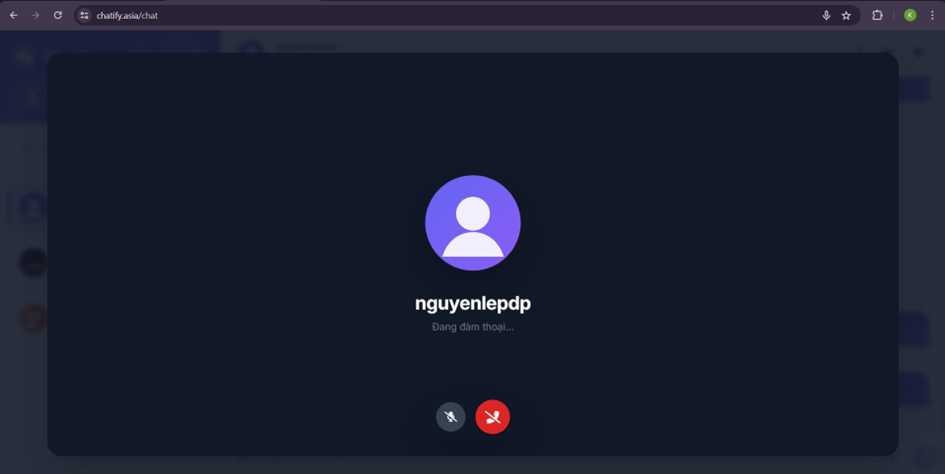

# Chatify — Real-time chat (microservices)

**Chatify** is a web chat system built as independent services: authentication, chat rooms and messages (REST + WebSocket/STOMP), file uploads via object storage, friends/social graph, and push notifications. The **Angular** SPA talks to backends through **Spring Cloud Gateway**. Each service uses an appropriate data store (PostgreSQL, MongoDB, Redis) and the full stack is orchestrated with **Docker Compose**.

**Live demo (example deployment):** [chatify.asia](https://chatify.asia) — UI is localized (e.g. Vietnamese) depending on deployment.

---

## Screenshots

### System architecture

Official project diagram: Cloudflare Tunnel, Angular + Nginx (port 3000), Spring Cloud Gateway (8080), **Auth** (8081 → PostgreSQL `authdb`), **Chat** (8082 → MongoDB `chatdb`, `/ws`, ties to Auth + Notification), **Media** (8083 → PostgreSQL `mediadb` + MinIO), **Notification** (8084 → Redis + Firebase FCM). The codebase also adds **friend-service** (8085) and real route prefixes via the gateway (e.g. `/api/auth/**`, `/api/v1/media/**` — see [API gateway routes](#api-gateway-routes) below).



### Login



### Registration



### Chat (1:1, sidebar, presence)



### Voice call (in-call UI)



---

## Features

- **Auth:** Registration, login, email verification, tokens, user profile (`auth-service`)
- **Chat:** Direct and group chat — rooms (`/rooms/**`), messages (`/messages/**`), read receipts, reactions, membership (`chat-service` + MongoDB)
- **Real-time:** WebSocket endpoint `/ws`, STOMP application prefix `/app` (e.g. `@MessageMapping("/chat")`)
- **Media:** Multipart upload to `POST /api/v1/media/upload`, stored in **MinIO** (`media-service`)
- **Friends:** Requests, friend list, block/unblock, suggestions — details: [friend-service/README.md](friend-service/README.md)
- **Notifications:** FCM token registration and push (`notification-service` + Redis + Firebase)
- **Frontend:** Angular 21, Tailwind, RxStomp/SockJS, Firebase Web SDK — see [chat-client/README.md](chat-client/README.md)

---

## Architecture (text overview)

Users reach the app from a browser (or mobile WebView). For public deployments, **Cloudflare Tunnel** can be the secure entry point, splitting **static assets** (UI) from **API and WebSocket** traffic.

- **Frontend:** **Angular** is built and served by **Nginx** (Docker Compose typically exposes it on host port **3000**).
- **API gateway:** **Spring Cloud Gateway** on **8080** routes REST and STOMP traffic. It enforces **JWT** on most routes; WebSockets can pass the token via query `?token=...` (see `AuthenticationFilter` in the gateway).

**Services behind the gateway:**

1. **auth-service (8081)** — accounts and users; **PostgreSQL** (`authdb`).
2. **chat-service (8082)** — rooms, messages, WebSocket `/ws`; **MongoDB** (`chatdb`); may call notification and other services internally.
3. **media-service (8083)** — uploads and metadata; **PostgreSQL** (`mediadb`) + **MinIO**.
4. **notification-service (host 8084, container 8080)** — FCM and messaging; **Redis** + **Firebase Cloud Messaging**.
5. **friend-service (8085)** — friends, blocks, requests; **PostgreSQL** (`frienddb`).

End-to-end: client → (optional tunnel) → **Angular/Nginx** for UI; client → **Gateway** for `/api/**`, `/rooms/**`, `/messages/**`, `/ws/**`, etc. → services → PostgreSQL / MongoDB / MinIO / Redis / Firebase as appropriate.

---

## Components & ports (Docker Compose on the host)

| Component | Container | Host port | Notes |
|-----------|-----------|-----------|--------|
| API Gateway | `api-gateway` | **8080** | Single entry for API + WS (`/ws`) |
| Auth | `auth-service` | 8081 | PostgreSQL `authdb` |
| Chat | `chat-service` | 8082 | MongoDB `chatdb` |
| Media | `media-service` | 8083 | PostgreSQL `mediadb` + MinIO |
| Notification | `notification-service` | **8084** → 8080 in container | Redis |
| Friend | `friend-service` | 8085 | PostgreSQL `frienddb` |
| Frontend (nginx) | `chat-frontend` | **3000** → 80 | Built from `chat-client` |
| PostgreSQL (auth) | `postgres-db` | 5432 | `authdb` |
| PostgreSQL (media) | `media-db` | 5434 | `mediadb` |
| PostgreSQL (friend) | `friend-db` | 5435 | `frienddb` |
| MongoDB | `chat-mongo` | 27017 | |
| Redis | `chat-redis` | 6379 | |
| MinIO API / Console | `minio` | 9000 / 9001 | e.g. bucket `chatapp-files` |
| Cloudflare Tunnel | `cloudflare-tunnel` | — | Optional; requires valid token |

Images, env vars, and volumes: [docker-compose.yml](docker-compose.yml).

---

## Prerequisites

- **JDK 17**, **Maven 3.x**
- **Node.js** + **npm** (match `packageManager` in [chat-client/package.json](chat-client/package.json) if possible)
- **Docker** and **Docker Compose** (`docker compose` or legacy `docker-compose`)

---

## Quick start (Docker)

From the repository root:

```bash
docker compose up --build
```

When containers are up:

- **Frontend:** http://localhost:3000  
- **API + WebSocket (via gateway):** http://localhost:8080 — STOMP endpoint: `ws://localhost:8080/ws` (or `wss://` behind TLS)

**Note:** The `tunnel` service is for exposing the stack to the Internet. For local-only work you can comment it out or omit real secrets (see **Security**).

---

## Local development (without full Docker, optional)

1. Run PostgreSQL, MongoDB, Redis, and MinIO locally (or start only the DB containers from Compose and run Java services on the host).
2. For each microservice, set `application.yml` / environment variables, then:

   ```bash
   mvn spring-boot:run
   ```

3. **Gateway** `uri` values must match real hostnames (Docker service names vs `localhost` and ports). You may temporarily edit [api-gateway/src/main/resources/application.yaml](api-gateway/src/main/resources/application.yaml).

4. **Angular** — `ng serve` uses the **development** build by default, which replaces [chat-client/src/environments/environment.ts](chat-client/src/environments/environment.ts) with [chat-client/src/environments/environment.development.ts](chat-client/src/environments/environment.development.ts) (see `fileReplacements` in [chat-client/angular.json](chat-client/angular.json)):

   ```bash
   cd chat-client
   npm install
   npm start
   ```

   App URL: http://localhost:4200  

   Point the dev environment at your local gateway, for example:

   - `apiUrl: 'http://localhost:8080'`
   - `wsUrl: 'ws://localhost:8080/ws'`

   (Some checked-in environment files may still target a production domain; adjust as needed.)

**CORS:** Allowed origins are configured in [api-gateway/src/main/resources/application.yaml](api-gateway/src/main/resources/application.yaml) (e.g. `http://localhost:4200`). Add your production domain there when deploying.

---

## API gateway routes

Configured in [api-gateway/src/main/resources/application.yaml](api-gateway/src/main/resources/application.yaml):

| Prefix (via gateway) | Target service |
|----------------------|----------------|
| `/api/auth/**` | auth-service |
| `/api/users/**` | auth-service (+ JWT) |
| `/messages/**`, `/rooms/**` | chat-service (+ JWT for REST) |
| `/ws/**` | chat-service (WebSocket; token in query or header) |
| `/api/v1/media/**` | media-service (+ JWT) |
| `/api/notifications/**` | notification-service |
| `/api/friends/**` | friend-service (+ JWT) |
| `/chatapp-files/**` | MinIO (public file access in current config; no `AuthenticationFilter` on this route) |

### Public endpoints (no JWT on gateway)

Per [RouteValidator.java](api-gateway/src/main/java/com/chatapp/api_gateway/filter/RouteValidator.java), paths containing these substrings are treated as open:

- `/api/auth/register`
- `/api/auth/login`
- `/eureka`

Other routes that use `AuthenticationFilter` expect a valid **Bearer** token (or WebSocket token query param).

### Representative REST entry points

- **Auth / users:** `POST /api/auth/register`, `POST /api/auth/login`, `GET /api/auth/me`, `GET /api/auth/verify`, … — [AuthController](auth-service/src/main/java/com/chatapp/auth_service/controller/AuthController.java), [UserController](auth-service/src/main/java/com/chatapp/auth_service/controller/UserController.java)
- **Chat:** under `/rooms/**`, `/messages/**` — [ChatController](chat-service/src/main/java/com/chatapp/chat_service/controller/ChatController.java)
- **Media:** `POST /api/v1/media/upload` — [MediaController](media-service/src/main/java/com/chatapp/media_service/controller/MediaController.java)
- **Notifications:** `POST /api/notifications/token`, `POST /api/notifications/send` — [NotificationController](notification-service/src/main/java/com/chatapp/notification_service/controller/NotificationController.java)
- **Friends:** full list in [friend-service/README.md](friend-service/README.md)

### WebSocket / STOMP

- SockJS/STOMP endpoint: **`/ws`** (same host/port as the API through the gateway).
- Client send prefix: **`/app`** (e.g. `@MessageMapping("/chat")` → `/app/chat`).
- Server config: [WebSocketConfig.java](chat-service/src/main/java/com/chatapp/chat_service/config/WebSocketConfig.java).

---

## Environment variables (reference)

Do not commit real secrets. Typical **variable names** (use your own values):

| Area | Examples |
|------|-----------|
| Gateway / auth / friend | `JWT_SECRET`, `JWT_EXPIRATION_MS` |
| Auth DB | `SPRING_DATASOURCE_URL`, `SPRING_DATASOURCE_USERNAME`, `SPRING_DATASOURCE_PASSWORD`, `SERVER_PORT` |
| Auth app | `APP_VERIFICATION_URL`, `APP_FRONTEND_URL`, `APP_BASE_URL`, `MAIL_USERNAME`, `MAIL_PASSWORD` |
| Chat | `SPRING_DATA_MONGODB_URI`, `NOTIFICATION_SERVICE_URL`, `SERVER_PORT` |
| Media | `MINIO_URL`, `MINIO_PUBLIC_URL`, `MINIO_ACCESS_KEY`, `MINIO_SECRET_KEY`, `MINIO_BUCKET` + datasource |
| Friend | `AUTH_SERVICE_URL`, `NOTIFICATION_SERVICE_URL` + datasource |
| Notification | `SPRING_DATA_REDIS_HOST`, `SPRING_DATA_REDIS_PORT`, `APP_FIREBASE_CONFIG` |
| Tunnel | `TUNNEL_TOKEN` (Cloudflare) |

Compose defaults use separate databases: `authdb`, `mediadb`, `frienddb`. Change credentials before making the repo public.

**Firebase:** `notification-service` needs a service account JSON (e.g. `firebase-service-account.json`). **Do not commit** it; use secrets or CI variables.

---

## Production frontend build

```bash
cd chat-client
npm install
npm run build
```

Output follows `angular.json`. The Docker image serves static files with nginx: [chat-client/Dockerfile](chat-client/Dockerfile).

---

## Repository layout

- `api-gateway/` — Spring Cloud Gateway  
- `auth-service/` — authentication and users  
- `chat-service/` — chat and WebSocket  
- `chat-client/` — Angular SPA  
- `friend-service/` — friends and social graph  
- `media-service/` — files and MinIO  
- `notification-service/` — FCM and Redis  
- `docs/images/` — README screenshots and architecture image  
- `docker-compose.yml` — full stack  
- `README.md` — this file  

---

## Security & GitHub hygiene

- **Never commit:** email passwords, production JWT secrets, Cloudflare tunnel tokens, real MinIO/DB credentials, or `firebase-service-account.json`.
- [docker-compose.yml](docker-compose.yml) may contain sensitive values — **rotate** anything that was ever exposed, prefer `.env` + `env_file` or CI secrets, and use placeholders in committed files.
- Keep `JWT_SECRET` consistent across services that sign or validate tokens (gateway, auth, friend, etc.).
- This README does not embed Firebase API keys or VAPID keys; keep those in environment-specific config only.

---

## More documentation

- [chat-client/README.md](chat-client/README.md) — Angular CLI, `ng serve`, tests, build  
- [friend-service/README.md](friend-service/README.md) — friend APIs, schema, `curl` examples, gateway integration  

---

## Authors / thesis project

*(Add student names, class, university, academic year.)*

## License

*(Optional — e.g. MIT or your institution’s policy.)*
